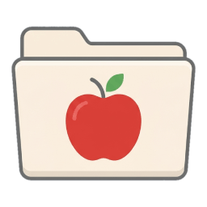

# MacBundle

[](https://github.com/Tyrrrz/.github/blob/prime/docs/project-status.md)
[](https://tyrrrz.me/ukraine)
[](https://github.com/Tyrrrz/MacBundle/actions)
[](https://nuget.org/packages/MacBundle)
[](https://nuget.org/packages/MacBundle)
[](https://discord.gg/2SUWKFnHSm)
[](https://twitter.com/tyrrrz/status/1495972128977571848)

<table>
    <tr>
        <td width="99999" align="center">Development of this project is entirely funded by the community. <b><a href="https://tyrrrz.me/donate">Consider donating to support!</a></b></td>
    </tr>
</table>

<p align="center">
    
</p>

**MacBundle** is an MSBuild extension that automatically generates a macOS `.app` bundle for your .NET application.

## Terms of use<sup>[[?]](https://github.com/Tyrrrz/.github/blob/prime/docs/why-so-political.md)</sup>

By using this project or its source code, for any purpose and in any shape or form, you grant your **implicit agreement** to all the following statements:

- You **condemn Russia and its military aggression against Ukraine**
- You **recognize that Russia is an occupant that unlawfully invaded a sovereign state**
- You **support Ukraine's territorial integrity, including its claims over temporarily occupied territories of Crimea and Donbas**
- You **reject false narratives perpetuated by Russian state propaganda**

To learn more about the war and how you can help, [click here](https://tyrrrz.me/ukraine). Glory to Ukraine! 🇺🇦

## Install

- 📦 [NuGet](https://nuget.org/packages/MacBundle): `dotnet add package MacBundle`

## Usage

Simply install the **MacBundle** package as private dependency in your project to integrate it into the build process:

```xml
<ItemGroup>
  <PackageReference Include="MacBundle" PrivateAssets="all" />
</ItemGroup>
```

The application bundle will be generated automatically in the output directory when building or publishing the project:

```diff
  MyApp
  ├── bin
  │   └── Release
  │       └── net11.0
+ │           ├── MyApp.app
+ │           │  └── Contents
+ │           │      ├── MacOS
+ │           │      │   ├── MyApp
+ │           │      │   ├── MyApp.dll
+ │           │      │   └── (...)
+ │           │      ├── Resources
+ │           │      │   └── AppIcon.icns
+ │           │      └── Info.plist
  │           └── (...)
  ├── MyApp.csproj
  └── (...)
```

### Customizing behavior

#### Explicitly enable or disable bundling

By default, **MacBundle** only generates the `.app` bundle when it's relevant — i.e., when the build is targeting the macOS runtime or when the runtime is not specified and the build is running on a macOS host. You can override this behavior by explicitly setting the `<GenerateMacOSBundle>` project property:

```xml
<Project Sdk="Microsoft.NET.Sdk">

  <PropertyGroup>
    <OutputType>WinExe</OutputType>
    <TargetFramework>net11.0</TargetFramework>
    <!-- ... -->

    <!-- Always generate the macOS app bundle -->
    <GenerateMacOSBundle>true</GenerateMacOSBundle>
  </PropertyGroup>

  <!-- ... -->

</Project>
```

#### Configure metadata

To customize the generated bundle's metadata, you can set the following project properties:

- `<MacOSBundleName>` — application bundle name. This is a short, internal name used to identify the bundle behind the scenes. Maps to the `CFBundleName` key in the `Info.plist` file. Defaults to the value of `<AssemblyName>`.
- `<MacOSBundleIdentifier>` — application bundle identifier. This is a unique identifier for your application, typically in reverse domain name format. Maps to the `CFBundleIdentifier` key in the `Info.plist` file. Defaults to:
  - Reverse domain name inferred from the configured git remote (e.g., `io.github.Tyrrrz.DiscordChatExporter`); or
  - The value of `<MacOSBundleName>`

#### Application icon

**MacBundle** automatically generates a macOS-specific `.icns` icon file based on the `.ico` icon file configured by the `<ApplicationIcon>` project property.
